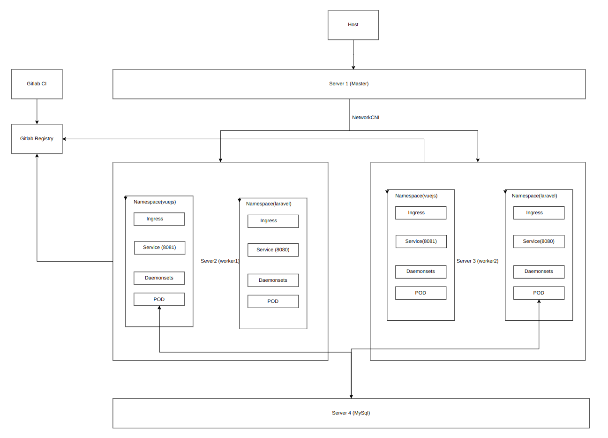

# Pre-requistics
- Make sure git is installed
- Make sure docker and docker-compose is installed

# Sample laravel app
- Clone this repository and cd into it
- Run the `./initialize-laravel.sh` script to do the folling tasks automatically

```
- Create folders in host and configure proper permissions
- Configure docker-compose env and laravel with it's env
- Build app image and bring docker stack up
- Install dependencies and generate app encryption key
```
- Once it's complete app should be browsable at `http://localhost:8080`
- Make further changes as necessary

# Sample vue.js app
- Clone this repository and cd into it
- Run these commands to initialize a fresh project
```
mkdir -p vuejs
docker run --rm -v "./vuejs:/app" -w "/app" -it node:20.6-alpine sh -c "npm install -g @vue/cli && vue create ."
```
- During installation prompts set values as below:
```
Generate project in current directory -> Y
Please pick a oreset -> Default ([Vue 3] babel, eslint)
Pick the package manager to use when installing dependencies -> Use Npn
```
- After project is ready, build image and run it
```
docker build -t cts_test:vuejs . -f vuejs.dockerfile
docker run -d -it -p 8081:80 --rm --name vuejs-app cts_test:vuejs
```
- Once it's complete app should be browsable at `http://localhost:8081`
- Make further changes as necessary

# Sample architecture in kubernetes
